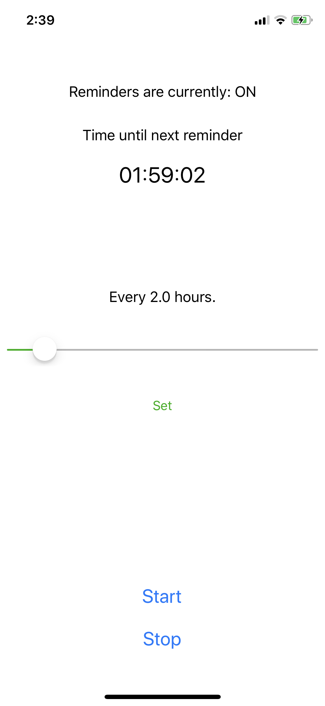

 

# WaterWorld
An iPhone app to set scheduled reminders to drink water. Made in 12 hours.

Features:
- Scheduled notifications (extended to WatchOS)
- Customizable notification timing
- Active notification timer display
- Stop/start notifications
- User settings persistance

# The Application

 

 

# Disclaimers
This application was created and tested for only the iPhone XS model in portrait mode.

Icons made by <a href="https://www.flaticon.com/authors/freepik" title="Freepik">Freepik</a> from <a href="https://www.flaticon.com/" title="Flaticon">www.flaticon.com</a>

